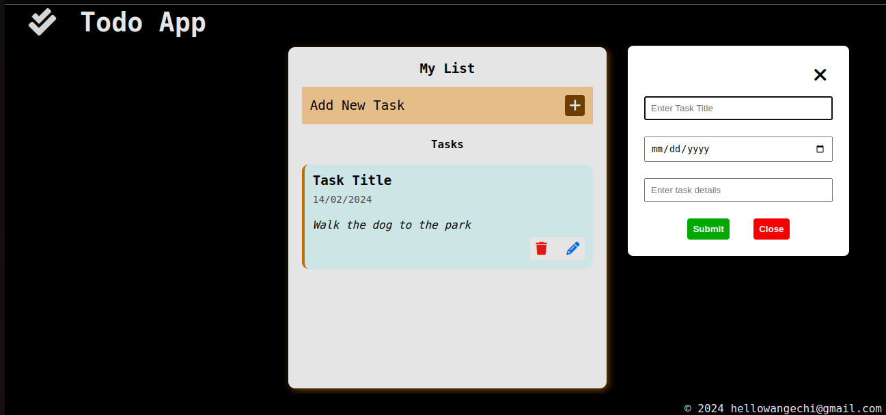

# Todo App
A simple Todo app built with HTML, CSS, and JavaScript. This app allows users to add, edit, and delete tasks, as well as view tasks with details like title, date, and description.

# Preview in browser

[Todo-App](https://hidoreen.github.io/CRUD_App/)

# Features
Add Task: Users can add new tasks by providing a title, date, and description.
Edit Task: Users can edit existing tasks by modifying their title, date, or description.
Delete Task: Users can delete tasks they no longer need.
Local Storage: Tasks are stored in the browser's local storage, allowing users to persist their tasks even after refreshing the page.

# Adding a Task:
Click on the "Add Task" button to open the task creation modal.
Enter the task title, date, and description in the respective fields.
Click "Submit" to add the task.
Editing a Task:

# Editing a Task:
Click on the "Edit" icon next to the task you want to edit.
Modify the task details in the edit modal.
Click "Submit" to save the changes.
Deleting a Task:

# Deleting a Task:
Click on the "Trash" icon next to the task you want to delete.
Viewing Tasks:

Tasks are displayed in a list format, showing the title, date, and description.
Tasks are stored in local storage and persist even after refreshing the page.

# Technologies Used
HTML
CSS
JavaScript
Webpack 5

# Preview

# Installation
To run the Todo app locally, follow these steps:

Clone this repository to your local machine.
Open the index.html file in your web browser.
Contributing
Contributions are welcome! Feel free to open an issue or submit a pull request.